<!-- _class: cover_c -->
<!-- _paginate: "" -->
<!-- _footer: 身心一统，兼蓄竞攀 -->
<!-- _header:  -->

# <!-- fit --> 课后体验 VR/AR 内容

###### “《灵魂机器的时代》与《媒介-论人的延伸》的阅读记录”

@符加亮
发布时间：2026年04月03日
<qaqnoname@163.com>

## 目录

<!-- _class: cols2_ol_ci fglass toc_a  -->
<!-- _footer: "" -->
<!-- _header: "CONTENTS" -->
<!-- _paginate: "" -->

- [引言](#引言)
- [Kurzweil 的 6 个 VR 核心观点](#Kurzweil-的-6-个-VR-核心观点)
- [Kurzweil 的 6 个 VR 核心观点（续）](#Kurzweil-的-6-个-VR-核心观点续)
- [Kurzweil 对 VR 的总体评价](#Kurzweil-对-VR-的总体评价)
- [McLuhan 的 5 条支持性观点](#McLuhan-的-5-条支持性观点)
- [McLuhan 的 5 条主要批判](#McLuhan-的-5-条-主要批判)
- [McLuhan 对库兹韦尔的“判词”](#McLuhan-对库兹韦尔的判词)

## 引言
 <!-- _class: cols-2 bq-green --> 

>《灵魂机器的时代》（Ray Kurzweil，2000）
>
>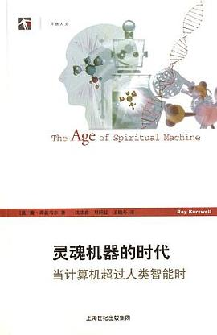
>两千年初期，第一次互联网浪潮的高潮期，库兹韦尔以其一贯的技术乐观主义，描绘了一个充满感官自由、创造力和亲密关系的虚拟现实未来图景。他预见了VR将成为人类进化的关键阶段，最终与纳米技术和人工智能融合，使人类超越生物学限制，成为自己灵魂的设计师。

>《媒介-论人的延伸》（迈克卢汉，1964）
>
>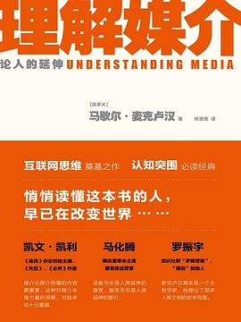
> 1964年，在电子媒介刚成为主流的时代，麦克卢汉以其独特的媒介理论视角，分析了技术如何作为人类感官的延伸，重塑我们的感知模式、社会结构和思维方式。他的“媒介即讯息”、“地球村”、“自我截除”等核心观点，为我们理解VR/AR技术的媒介效应提供了重要框架。

## Kurzweil 的 6 个 VR 核心观点
<!-- _class: cols-3 bq-blue-->

> 一、虚拟现实是感官的终极延伸
>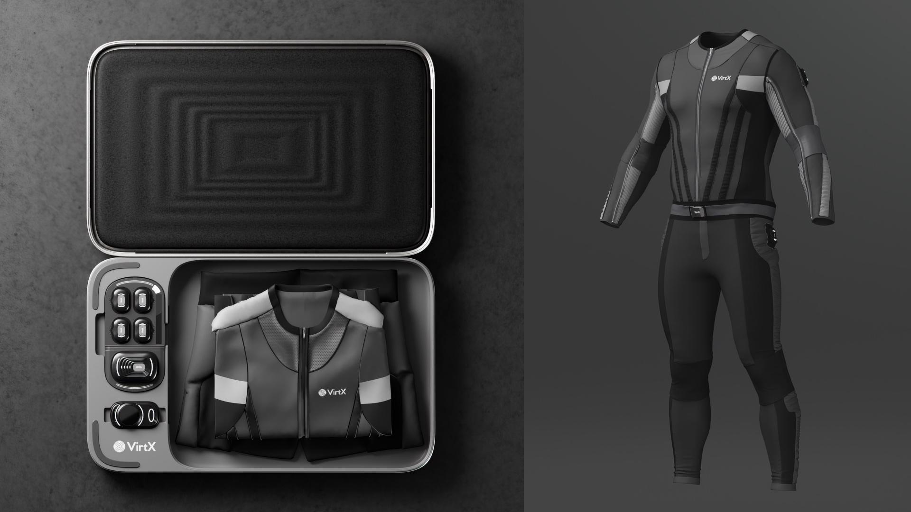
>- 当前局限将被克服（分辨率、延迟、舒适度）
>- 全感官覆盖：触觉反馈衣、嗅觉合成、旋转平台
>- 预计2007年实现高质量VR 

> 二、神经植入将实现“直接进入”
>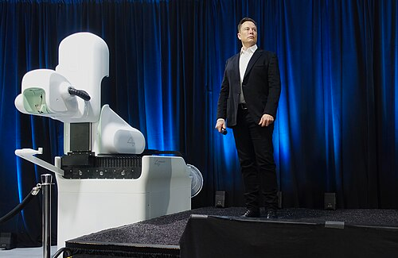
> - 21世纪30年代后，无需外部设备
> - 神经植入物直接输入感官信号、读取运动意图
> - 虚拟体验将与真实世界 indistinguishable

> 三、虚拟现实将重塑性与亲密关系
>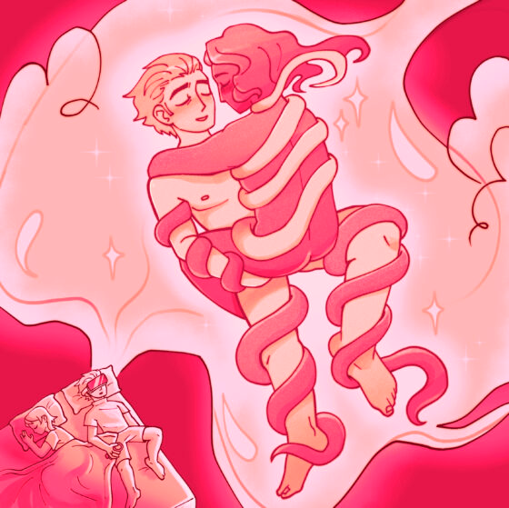
> - 完全逼真的视听触虚拟性行为将成为现实
> - 更安全、更刺激、更可定制
> - 可改变外貌、个性，多人共享虚拟躯体
> - 对婚姻忠贞定义带来挑战

### Kurzweil 的 6 个 VR 核心观点（续）
<!-- _class: cols-3 bq-blue-->

> 四、真实世界本身也会变得“虚拟化”
>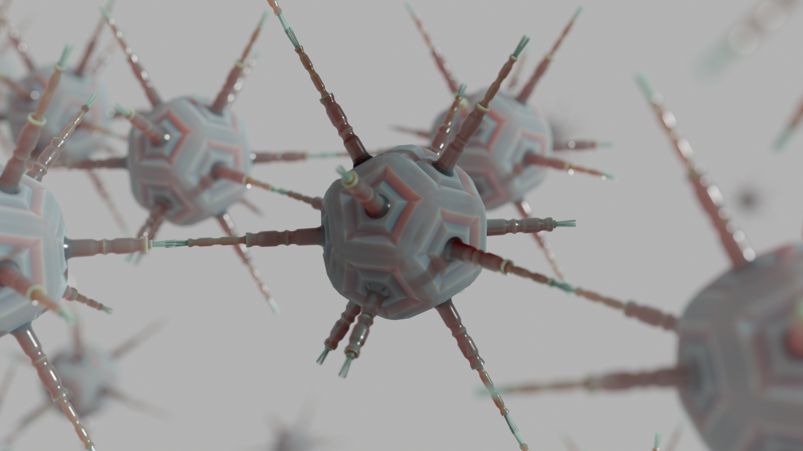
>- 纳米机器人集群（“实用雾”）可重组物理环境
>- 房间可瞬间变成森林、泰姬陵或游泳池
>- 真实世界获得虚拟世界的灵活性
>- 真实与虚拟界限消失

> 五、虚拟现实与心灵、幽默、愉悦的深层连接
>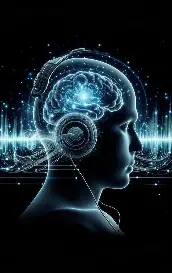
>- 直接刺激大脑特定区域诱发幽默感、性兴奋、松弛反应
>- 脑激发音乐技术通过脑电波反馈生成共鸣音乐
>- VR 能直接控制内在情感状态
>- 机遇与危险并存（如滥用成瘾）

> 六、最终，虚拟现实成为灵魂机器的舞台
>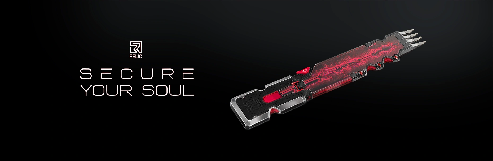
>- 21世纪末，思维下载到计算媒体（“软件”）
>- 虚拟环境成为默认生活界面
>- 可随时改变躯体、环境，与云端他人/AI互动
>- “我们不是想成为精灵的人。我们是想成为人的精灵。”

## Kurzweil 对 VR 的总体评价

> **虚拟现实不是逃避现实的玩具，而是人类进化的自然延伸。它将赋予我们前所未有的感官自由、创造力和亲密关系，最终与纳米技术、人工智能一起，使人类超越生物学的限制，成为自己灵魂的设计师。**
>
> 承认风险：成瘾、滥用、身份混淆、道德滑坡等，但认为收益远大于风险。

## McLuhan 视角下的 5 条支持性观点
<!-- _class: trans -->
<!-- _footer: "" -->
<!-- _paginate: "" -->

### 1. “媒介是人的延伸”
<!-- _class: cols-2-64 bq-green caption -->

- VR/神经植入延伸视觉、听觉、触觉、本体感觉
- 麦克卢汉会认为这是他理论最直白的实现
- 人把自己变成了“电子躯体”

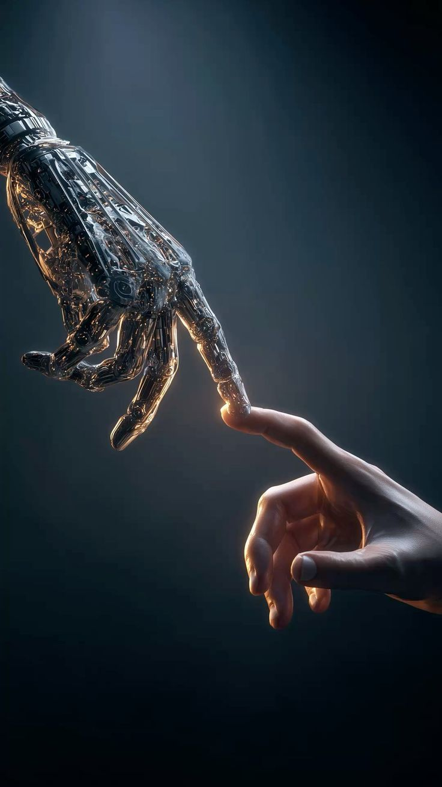

变成软件

### 2. “媒介即讯息”
<!-- _class: cols-2-64 bq-green caption -->

- 媒介形式（而非内容）改变人类感知模式、社会结构和思维方式
- VR 的“完全沉浸式、实时响应、感官封闭”才是核心
- 改变人的自我认知、时间感、真实与虚构的边界

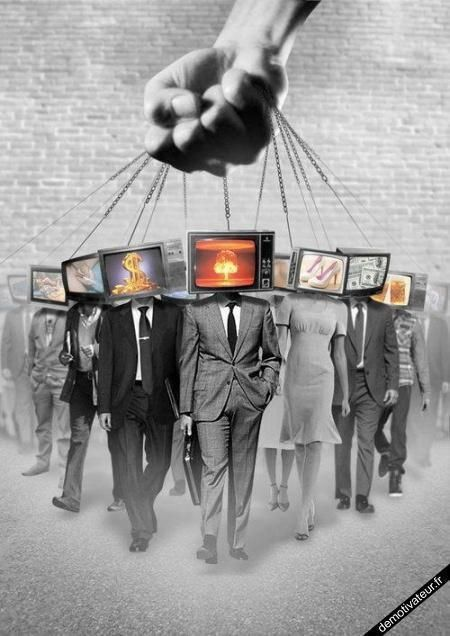

新的媒介更强效的控制

### 3. “地球村”的升级版
<!-- _class: cols-2-64 bq-green caption -->

- VR 把“地球村”升级为“任意村”
- 瞬间与任何人共处同一个虚拟空间，不受物理距离限制
- 完全符合麦克卢汉关于“电子媒介取消时空”的预言

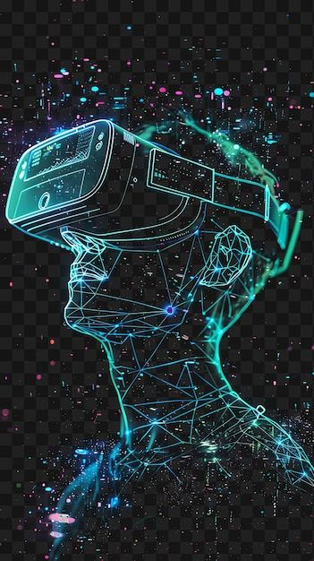

虚拟共在

### 4. “媒介即按摩”
<!-- _class: cols-2-64 bq-green caption -->

- VR 是最强力的“按摩”，同时揉捏视觉、听觉、触觉、前庭系统
- 长期使用 VR，人的感官比率会被彻底改变
- 直接刺激大脑幽默区、性兴奋区，正是按摩到了神经层面

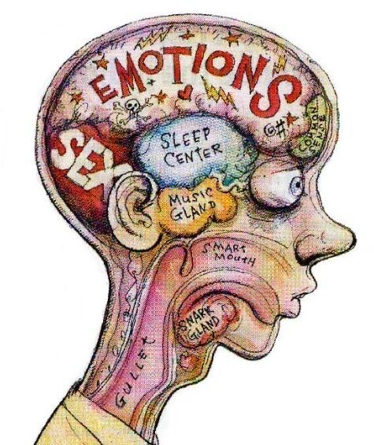

感官重塑

### 5. “自我截除”理论
<!-- _class: cols-2-64 bq-green caption-->

- VR 和神经植入完美模拟真实感官时，真实身体感知能力会退化
- 面对面社交能力、对物理环境的警觉性会严重萎缩
- 库兹韦尔乐观的“成为软件”正是危险的自我截除

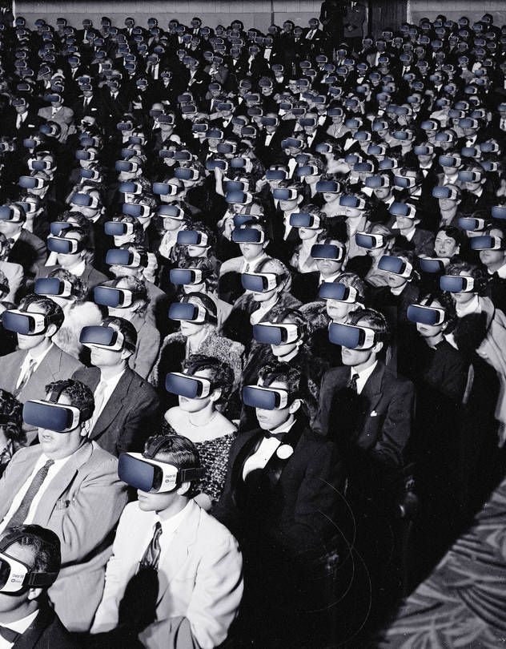

自我截除

## McLuhan 视角下的 5 条主要批判
<!-- _class: trans -->
<!-- _footer: "" -->
<!-- _paginate: "" -->

### 1. “后视镜思维”问题
<!-- _class: cols-2-64 bq-red caption-->

- 库兹韦尔用“真实世界”作为衡量 VR 的标尺
- VR 不是“更好的真实”，而是完全不同的环境
- 核心特征不是“像真实”，而是“可编程的感官”

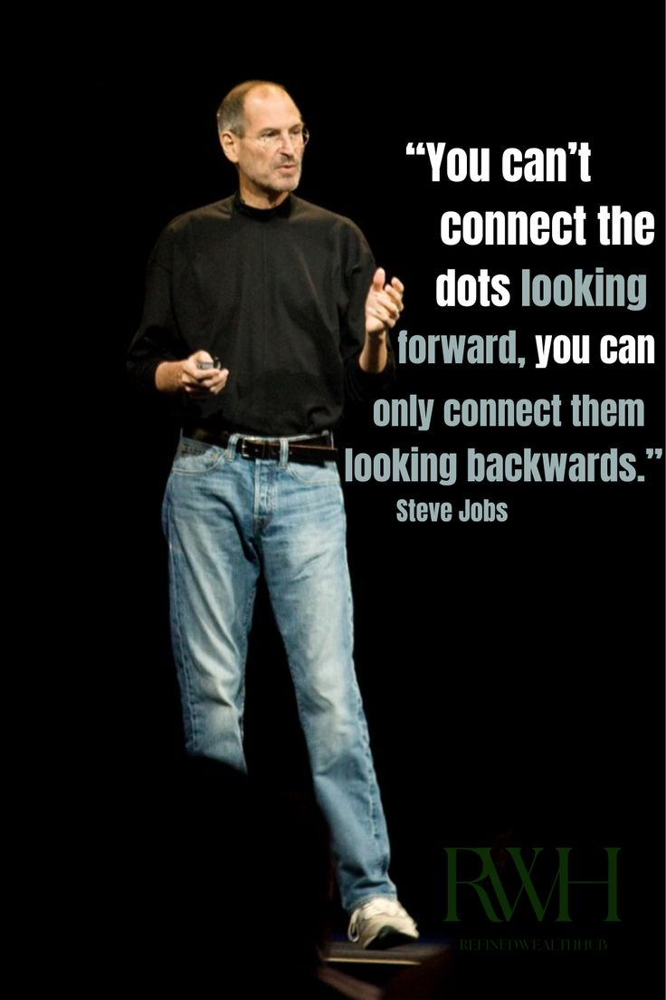

后视镜思维

### 2. “冷/热媒介”参与度问题
<!-- _class: cols-2-64 bq-red caption-->

- VR 具有高清晰度（热媒介）但要求高交互（冷媒介）
- 这种混合可能产生“参与性麻木”：以为在主动探索，实际上反应被系统预设

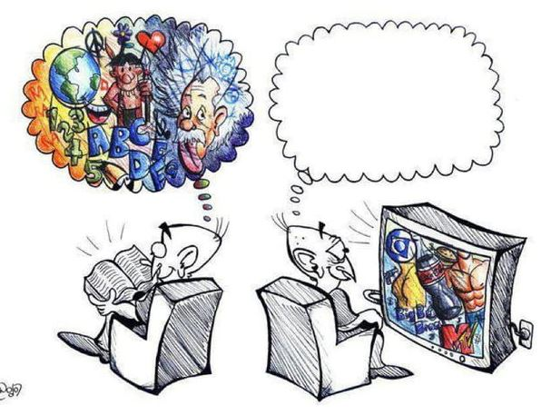

冷/热媒介

### 3. 对技术乐观主义的质疑
<!-- _class: cols-2-64 bq-red caption -->

- 人成为技术的伺服机制：我们发明工具，然后工具重塑我们
- 库兹韦尔认为自由选择升级，实际上被“收益递增律”和商业竞争裹挟
- “成为软件、永生”是最彻底的自我异化

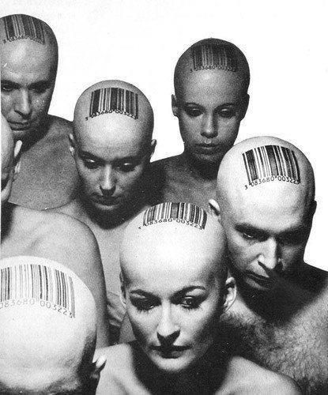

技术异化

### 4. “地球村”的黑暗面
<!-- _class: cols-2-64 bq-red caption-->

- 地球村不仅是和谐共处，也是无休止的冲突和部落化
- VR 虚拟村落中的仇恨、骚扰、信息茧房、身份欺骗可能更严重

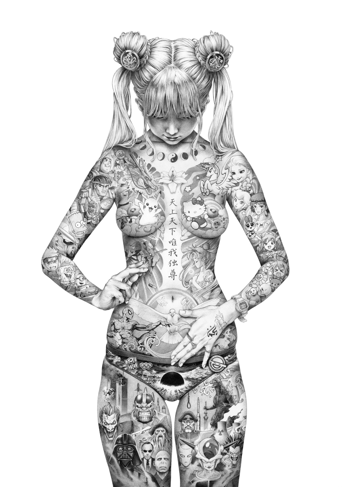

图片占位 09：地球村阴影面（后续替换）

### 5. “反环境”的丧失
<!-- _class: cols-2-64 bq-red caption-->

- 要理解媒介，需要跳出它创造“反环境”
- 如果所有人都沉浸在 VR 中，谁还能提供非 VR 视角来批判 VR？
- 将是一个没有镜子、没有外部参照系的封闭系统

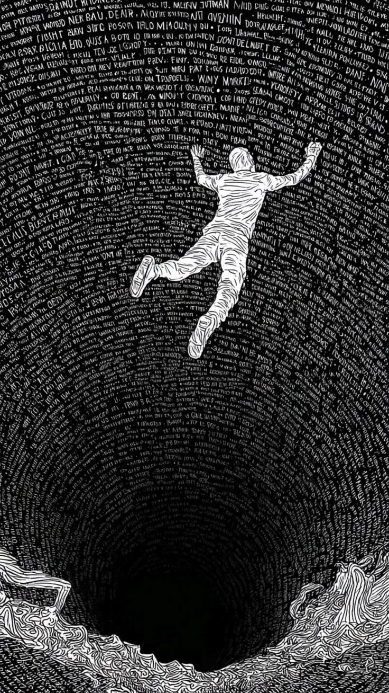

图片占位 10：反环境丧失（后续替换）

## McLuhan 对库兹韦尔的“判词”

> **库兹韦尔准确地描述了技术延伸的终点，但他错把终点当成了解放。麦克卢汉会提醒：当你把灵魂装进机器，机器就不再是你的工具，而是你的主人。VR不是灵魂机器的时代，而是肉身被遗忘、感官被编程、自由意志被算法替代的时代——只不过你会感觉很好。**
> 原文：一旦拱手将自己的感官和神经系统交给别人，让人家操纵——而这些人又想靠租用我们的眼睛、耳朵和神经从中渔利，我们实际上就没有任何权利了。

## 麦克卢汉核心观点对照表

| 麦克卢汉核心观点 | 对库兹韦尔VR的看法 | 符合/批判 |
|----------------|-------------------|-----------|
| 媒介是人的延伸 | VR同时延伸视觉、听觉、触觉、平衡感 | ✅ 符合 |
| 媒介即讯息 | VR的形式（沉浸/交互）比内容更重要 | ✅ 符合 |
| 地球村 | VR创造即时共在的虚拟村落 | ✅ 符合 |
| 媒介即按摩 | VR强力重塑感官比率 | ✅ 符合 |
| 自我截除 | 真实身体感知和社交能力会萎缩 | ⚠️ 部分符合但库兹韦尔乐观 |
| 后视镜思维 | 用“真实”衡量VR，没有看到VR的断裂性 | ❌ 批判 |
| 冷/热媒介混淆 | VR的高清晰+高交互可能导致参与性麻木 | ❌ 批判 |
| 技术乐观主义批判 | 人成为技术的伺服机制，失去选择 | ❌ 批判 |
| 地球村的黑暗面 | 忽略虚拟世界的冲突、骚扰、茧房 | ❌ 批判 |
| 反环境的丧失 | 无人能跳出VR批判VR | ❌ 批判 |

## 结论

- **Kurzweil 的乌托邦愿景**：VR作为人类进化的工具，将解放感官、增强体验、超越生物学限制
- **McLuhan 的批判视角**：VR作为媒介，本身在重塑人类感知和社会结构，带来新形式的控制与异化
- **核心张力**：技术决定论 vs. 媒介生态观
- **启示**：在拥抱VR/AR技术时，需警惕其媒介效应而不仅关注表面功能

---

<!-- _class: cover_e -->
<!-- _header: "" -->
<!-- _footer: "" -->
<!-- _paginate: "" -->

# 谢谢观看
## Q & A